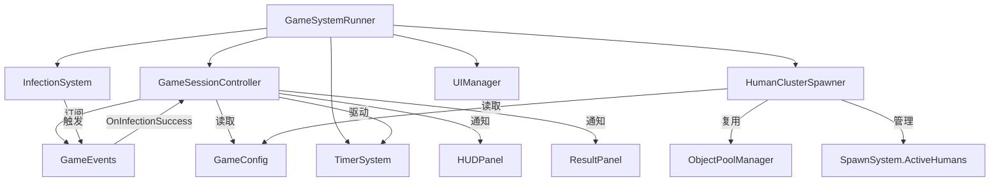
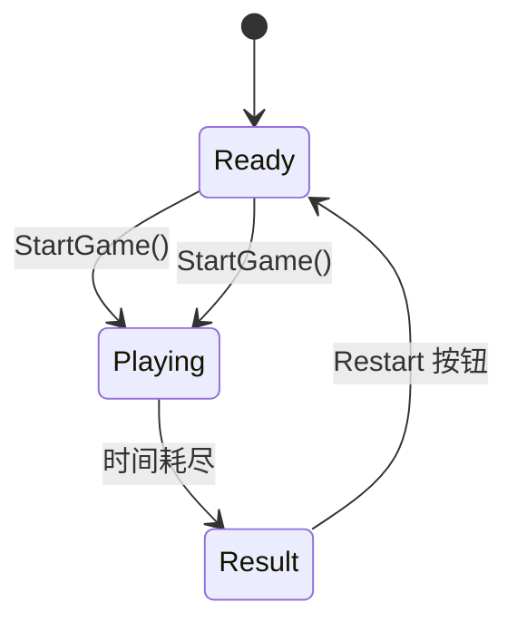

# 技术设计文档 — session-loop-v1

## 概述

本设计文档描述僵尸感染游戏第一版单局闭环（session-loop-v1）的技术实现方案。核心目标是在现有架构基础上引入完整的单局生命周期管理：从准备阶段到游戏进行中再到结算，同时将人类刷新方式从均匀随机散布升级为更具游戏性的"人群簇"模式。

**主要变更点：**
1. 新增 `GameSessionController` — 管理 Ready/Playing/Result 状态、感染计数、评级计算
2. 新增 `HumanClusterSpawner` — 基于簇的人类生成策略，替代 SpawnSystem 的均匀随机刷新
3. 扩展 `GameConfig` — 新增单局时长、目标感染数、评级阈值等配置字段
4. 更新 `HUDPanel` — 增加感染进度、评级预览、目标达成提示
5. 新增 `ResultPanel` — 结算面板，展示最终成绩与重开按钮
6. 调整 `GameSystemRunner` — 集成 GameSessionController 作为单局流程的顶层调度者

**设计原则：**
- 遵循现有事件总线（GameEvents）松耦合模式
- 所有数值参数集中在 GameConfig ScriptableObject
- 新系统由 GameSystemRunner 统一初始化和调度
- 复用 ObjectPoolManager 的对象池接口

## 架构

### 系统层次关系



### 状态流转



### 数据流（Playing 状态每帧）

```
Input → PlayerController → HumanClusterSpawner.UpdateSpawn()
→ SpawnSystem.UpdateHumanAIs() → InfectionSystem.UpdateZombieAIs()
→ InfectionSystem.UpdateInfectionCheck() → TimerSystem.UpdateTimer()
→ GameSessionController.UpdateSession()（刷新 HUD 数据）
```

## 组件与接口

### 1. GameSessionController

**职责：** 单局状态管理、感染计数、评级计算、驱动 UI 更新

**命名空间：** `Game.Core`

**生命周期：** 由 GameSystemRunner 在 Inspector 注入引用，通过 `Initialize()` 初始化

```csharp
public class GameSessionController : MonoBehaviour
{
    // === Inspector 注入 ===
    [SerializeField] private GameConfig m_config;
    [SerializeField] private TimerSystem m_timerSystem;
    [SerializeField] private InfectionSystem m_infectionSystem;

    // === 公开属性 ===
    public SessionState CurrentState { get; }
    public int InfectedCount { get; }
    public int MaxZombieCount { get; }
    public int MaxChainCount { get; }
    public bool IsVictory { get; }
    public SessionRating CurrentRating { get; }
    public float RemainingTime { get; }

    // === 公开 API ===
    public void Initialize();
    public void StartSession();       // Ready → Playing
    public void EndSession();         // Playing → Result（由 TimerEnd 触发）
    public void RestartSession();     // Result → Ready → Playing
    public SessionRating CalculateRating(int infectedCount);
    
    // === 事件 ===
    public event Action<int> OnInfectedCountChanged;
    public event Action<SessionRating> OnRatingChanged;
    public event Action OnVictoryAchieved;
    public event Action<SessionResult> OnSessionEnd;
}
```

**关键设计决策：**
- GameSessionController 不替代 GameStateManager，而是在其上层封装单局逻辑。GameStateManager 继续管理 Start/Playing/Settlement 全局状态，GameSessionController 管理局内 Ready/Playing/Result 子状态。
- 评级计算为纯函数，便于测试和 HUD 实时预览复用。
- 通过实例事件（非全局 GameEvents）通知 HUD 和 ResultPanel，避免污染全局事件总线。

### 2. SessionState 枚举

```csharp
public enum SessionState
{
    Ready,    // 准备阶段，等待开始
    Playing,  // 游戏进行中
    Result    // 结算阶段
}
```

### 3. SessionRating 枚举

```csharp
public enum SessionRating
{
    C,   // < TargetInfectedCount
    B,   // >= Target, < AScore
    A,   // >= AScore, < SScore
    S,   // >= SScore, < SSScore
    SS   // >= SSScore
}
```

### 4. SessionResult 数据类

```csharp
public class SessionResult
{
    public int InfectedCount { get; }
    public int MaxZombieCount { get; }
    public int MaxChainCount { get; }
    public SessionRating Rating { get; }
    public bool IsVictory { get; }
    public float ElapsedTime { get; }
}
```

### 5. HumanClusterSpawner

**职责：** 按簇生成人类，替代 SpawnSystem 的均匀随机刷新逻辑

**命名空间：** `Game.Gameplay.Wave`

```csharp
public class HumanClusterSpawner : MonoBehaviour
{
    // === Inspector 注入 ===
    [SerializeField] private ObjectPoolManager m_poolManager;
    [SerializeField] private SpawnSystem m_spawnSystem;
    [SerializeField] private GameConfig m_config;
    [SerializeField] private Transform m_playerTransform;

    // === 簇配置（Inspector 或 GameConfig） ===
    [SerializeField] private int m_smallClusterMin = 3;
    [SerializeField] private int m_smallClusterMax = 5;
    [SerializeField] private int m_mediumClusterMin = 8;
    [SerializeField] private int m_mediumClusterMax = 12;
    [SerializeField] private float m_clusterSpawnInterval = 3f;
    [SerializeField] private float m_clusterMinSeparation = 5f;
    [SerializeField] private float m_initialSpawnMinDist = 3f;
    [SerializeField] private float m_initialSpawnMaxDist = 8f;
    [SerializeField] private float m_periodicSpawnMinDistFromPlayer = 8f;

    // === 公开 API ===
    public void Initialize(Func<IReadOnlyList<Vector2>> getZombiePositions);
    public void SpawnInitialClusters();
    public void UpdateSpawn(float deltaTime);
    public void Reset();
    
    // === 内部方法 ===
    private void SpawnCluster(Vector2 center, int count);
    private Vector2 PickClusterCenter(float minDistFromPlayer, float minDistFromOtherClusters);
    private Vector2 GetPositionInCluster(Vector2 center, float radius);
}
```

**关键设计决策：**
- HumanClusterSpawner 不直接管理 ActiveHumans 列表，而是通过 SpawnSystem 的接口（或直接操作 ObjectPoolManager + 注册到 SpawnSystem）来保持列表一致性。
- 簇内人类位置使用高斯分布或均匀圆盘分布，使人群看起来自然聚集。
- 保留 SpawnSystem 的 `ActiveHumans`、`ReturnHuman`、`UpdateHumanAIs`、`ClampToMap` 等接口不变，HumanClusterSpawner 仅替代生成策略。

### 6. HUDPanel 扩展

在现有 HUDPanel 基础上新增：

```csharp
// 新增 UI 元素
[SerializeField] private Text m_infectionCountText;    // "当前数/目标数"
[SerializeField] private Text m_ratingPreviewText;     // "C" / "B" / "A" / "S" / "SS"
[SerializeField] private GameObject m_victoryIndicator; // "目标达成" 提示

// 新增方法
public void UpdateInfectionCount(int current, int target);
public void UpdateRatingPreview(SessionRating rating);
public void ShowVictoryIndicator();
public void HideVictoryIndicator();
```

### 7. ResultPanel

**职责：** 结算面板，展示最终成绩

**命名空间：** `Game.UI`

```csharp
public class ResultPanel : MonoBehaviour
{
    [SerializeField] private Text m_infectedCountText;
    [SerializeField] private Text m_maxZombieCountText;
    [SerializeField] private Text m_ratingText;
    [SerializeField] private Text m_victoryStatusText;
    [SerializeField] private Button m_restartButton;

    public void ShowResult(SessionResult result, Action onRestart);
}
```

### 8. GameConfig 扩展

新增字段（在现有 GameConfig 中添加新的 Header 区域）：

```csharp
[Header("单局目标与评级")]
[SerializeField] private int m_targetInfectedCount = 80;
[SerializeField] private int m_aScoreInfectedCount = 150;
[SerializeField] private int m_sScoreInfectedCount = 250;
[SerializeField] private int m_ssScoreInfectedCount = 350;

public int TargetInfectedCount => m_targetInfectedCount;
public int AScoreInfectedCount => m_aScoreInfectedCount;
public int SScoreInfectedCount => m_sScoreInfectedCount;
public int SSScoreInfectedCount => m_ssScoreInfectedCount;
```

注意：`GameDurationSeconds` 已由现有 `MatchDuration` 字段覆盖（默认 240 秒，需调整为 180 秒或在 Inspector 中配置）。

### 9. GameEvents 扩展

新增事件用于 GameSessionController 与其他系统通信：

```csharp
// 单局状态变化事件
public static event Action<SessionState> OnSessionStateChanged;
public static void RaiseSessionStateChanged(SessionState newState);

// 感染计数变化事件（供 HUD 订阅）
public static event Action<int, int> OnInfectionCountChanged; // (current, target)
public static void RaiseInfectionCountChanged(int current, int target);
```

### 10. GameSystemRunner 集成变更

```csharp
// 新增 Inspector 引用
[SerializeField] private GameSessionController m_sessionController;
[SerializeField] private HumanClusterSpawner m_clusterSpawner;
[SerializeField] private ResultPanel m_resultPanel;

// InitializeSystems() 中新增：
// - m_sessionController.Initialize()
// - m_clusterSpawner.Initialize(...)

// HandleStateChanged() 中：
// - Playing 状态：调用 m_sessionController.StartSession()
// - Settlement 状态：调用 m_sessionController.EndSession()

// UpdatePlaying() 中：
// - 替换 m_spawnSystem.UpdateSpawn() 为 m_clusterSpawner.UpdateSpawn()
```

## 数据模型

### SessionResult

| 字段 | 类型 | 说明 |
|------|------|------|
| InfectedCount | int | 本局累计感染人数 |
| MaxZombieCount | int | 本局同时存在的最大僵尸数量 |
| MaxChainCount | int | 本局最高连锁感染数（预留） |
| Rating | SessionRating | 最终评级 |
| IsVictory | bool | 是否通关（InfectedCount >= TargetInfectedCount） |
| ElapsedTime | float | 实际游戏时长（秒） |

### 评级阈值映射

| 评级 | 条件 |
|------|------|
| C | InfectedCount < TargetInfectedCount (80) |
| B | TargetInfectedCount <= InfectedCount < AScoreInfectedCount (150) |
| A | AScoreInfectedCount <= InfectedCount < SScoreInfectedCount (250) |
| S | SScoreInfectedCount <= InfectedCount < SSScoreInfectedCount (350) |
| SS | InfectedCount >= SSScoreInfectedCount (350) |

### 簇生成参数

| 参数 | 默认值 | 说明 |
|------|--------|------|
| SmallClusterMin | 3 | 小簇最少人数 |
| SmallClusterMax | 5 | 小簇最多人数 |
| MediumClusterMin | 8 | 中簇最少人数 |
| MediumClusterMax | 12 | 中簇最多人数 |
| ClusterSpawnInterval | 3.0s | 持续补充间隔 |
| ClusterMinSeparation | 5.0 | 簇间最小中心距离 |
| InitialSpawnMinDist | 3.0 | 初始簇距玩家最小距离 |
| InitialSpawnMaxDist | 8.0 | 初始簇距玩家最大距离 |
| PeriodicSpawnMinDistFromPlayer | 8.0 | 持续补充簇距玩家最小距离 |

### GameConfig 完整字段清单（新增部分）

| 字段名 | 类型 | 默认值 | 说明 |
|--------|------|--------|------|
| TargetInfectedCount | int | 80 | 通关目标感染人数 |
| AScoreInfectedCount | int | 150 | A 级评分阈值 |
| SScoreInfectedCount | int | 250 | S 级评分阈值 |
| SSScoreInfectedCount | int | 350 | SS 级评分阈值 |

## 正确性属性（Correctness Properties）

*正确性属性是一种在系统所有有效执行中都应成立的特征或行为——本质上是对系统应做什么的形式化陈述。属性是人类可读规格说明与机器可验证正确性保证之间的桥梁。*

### Property 1: 评级计算正确性

*For any* 非负整数 InfectedCount 和有效的评级阈值配置（Target <= A <= S <= SS），`CalculateRating(infectedCount)` 应返回与阈值规则完全一致的评级：
- InfectedCount < Target → C
- Target <= InfectedCount < A → B
- A <= InfectedCount < S → A
- S <= InfectedCount < SS → S
- InfectedCount >= SS → SS

**Validates: Requirements 4.1, 4.2, 4.3, 4.4, 4.5, 4.6, 7.3**

### Property 2: 胜利判定与评级一致性

*For any* 非负整数 InfectedCount 和 TargetInfectedCount，`IsVictory` 为 true 当且仅当 InfectedCount >= TargetInfectedCount，且此时评级不为 C；`IsVictory` 为 false 当且仅当评级为 C。

**Validates: Requirements 3.4, 8.5, 8.6**

### Property 3: 会话重置完整性

*For any* 先前累积的 InfectedCount、MaxZombieCount、MaxChainCount 值（任意非负整数），调用 `StartSession()` 后，InfectedCount 应为 0，MaxZombieCount 应为 0，MaxChainCount 应为 0。

**Validates: Requirements 1.2**

### Property 4: 感染计数单调递增与最大值追踪

*For any* 长度为 N 的感染事件序列（每个事件附带一个活跃僵尸数量），处理完所有事件后：
- InfectedCount 应等于 N
- MaxZombieCount 应等于序列中所有活跃僵尸数量的最大值

**Validates: Requirements 3.1, 3.2**

### Property 5: 簇大小有效性

*For any* 生成的人群簇，其包含的人类单位数量应满足：若为 SmallCluster 则在 [3, 5] 范围内，若为 MediumCluster 则在 [8, 12] 范围内。不存在其他大小的簇。

**Validates: Requirements 5.3, 6.2**

### Property 6: 初始簇放置约束

*For any* 玩家位置和地图范围，初始生成的簇应满足：
- 簇数量在 [2, 3] 范围内
- 每个簇中心距玩家距离在 [3, 8] 范围内
- 任意两个簇中心之间的距离 >= 5

**Validates: Requirements 5.1, 5.2, 5.4**

### Property 7: 持续补充簇放置约束

*For any* 玩家位置、地图范围和已有簇集合，新生成的持续补充簇应满足：
- 簇中心在地图范围内
- 簇中心距玩家距离 >= 8
- 簇中心与所有已有簇中心的距离 >= 5

**Validates: Requirements 6.3, 6.4**

### Property 8: 人类数量上限约束

*For any* 场上活跃人类数量 >= HumanMaxCount 的状态，HumanClusterSpawner 不应生成新的簇（即调用 UpdateSpawn 后活跃人类数量不增加）。

**Validates: Requirements 6.5**

### Property 9: 时间格式化正确性

*For any* 非负浮点数 remainingSeconds（范围 [0, 9999]），格式化为 "MM:SS" 后应满足：
- minutes = floor(remainingSeconds / 60)
- seconds = floor(remainingSeconds % 60)
- 输出格式为两位数字冒号两位数字

**Validates: Requirements 7.1**

## 错误处理

### 配置缺失

| 场景 | 处理方式 |
|------|----------|
| GameConfig 未注入 | GameSessionController.Initialize() 输出 LogError，使用安全默认值（180s/80目标） |
| 评级阈值配置不合理（如 Target > A） | CalculateRating 按实际值计算，不做额外校验（信任策划配置） |
| TimerSystem 未注入 | 跳过倒计时逻辑，SessionState 不会自动切换到 Result |

### 对象池异常

| 场景 | 处理方式 |
|------|----------|
| ObjectPoolManager.GetHuman() 返回 null | HumanClusterSpawner 停止当前簇的剩余生成，输出 LogWarning |
| 簇放置找不到满足约束的位置（超过最大尝试次数） | 退化为任意合法地图内位置，输出 LogWarning |

### 状态异常

| 场景 | 处理方式 |
|------|----------|
| 非 Playing 状态收到 InfectionSuccess 事件 | 忽略，不递增计数 |
| 重复调用 StartSession() | 幂等处理，重新重置所有计数 |
| ResultPanel 的 Restart 按钮在非 Result 状态被点击 | 按钮仅在 Result 状态可见，通过 UI 层防御 |

## 测试策略

### 属性测试（Property-Based Testing）

**框架选择：** NUnit + FsCheck.NUnit（C# 生态中成熟的 PBT 库，与 Unity Test Framework 兼容）

**配置：**
- 每个属性测试最少运行 100 次迭代
- 每个测试用注释标注对应的设计属性编号

**测试标签格式：** `Feature: session-loop-v1, Property {N}: {property_text}`

**属性测试清单：**

| 属性 | 测试类 | 生成器 |
|------|--------|--------|
| Property 1: 评级计算 | `RatingCalculationTests` | 随机 int [0, 1000] + 随机有效阈值组合 |
| Property 2: 胜利判定 | `VictoryDeterminationTests` | 随机 int [0, 500] + 随机 target [1, 200] |
| Property 3: 会话重置 | `SessionResetTests` | 随机先前状态值 |
| Property 4: 感染计数 | `InfectionCountingTests` | 随机长度 [0, 200] 的事件序列 |
| Property 5: 簇大小 | `ClusterSizeTests` | 随机簇类型选择 |
| Property 6: 初始簇放置 | `InitialClusterPlacementTests` | 随机玩家位置 + 地图范围 |
| Property 7: 持续补充簇放置 | `PeriodicClusterPlacementTests` | 随机玩家位置 + 已有簇集合 |
| Property 8: 人类上限 | `HumanCapTests` | 随机活跃数量 >= max |
| Property 9: 时间格式化 | `TimeFormattingTests` | 随机 float [0, 9999] |

### 单元测试（Example-Based）

**框架：** NUnit（Unity Test Framework 内置）

**测试重点：**
- 状态机转换的具体场景（Ready→Playing→Result→Ready 完整循环）
- ResultPanel 数据展示的具体示例
- HUD 目标达成提示的显示/隐藏
- Restart 按钮触发新一局的完整流程
- 边界值：InfectedCount 恰好等于各阈值时的评级

### 集成测试

**测试重点：**
- GameSessionController 与 GameEvents.OnInfectionSuccess 的事件订阅
- HumanClusterSpawner 与 ObjectPoolManager 的池操作
- HumanClusterSpawner 与 SpawnSystem.ActiveHumans 列表的一致性
- GameSystemRunner 完整初始化流程中新组件的正确注入

### 测试文件组织

```
Assets/Game/Tests/EditMode/
├── Core/
│   ├── RatingCalculationPropertyTests.cs
│   ├── SessionResetPropertyTests.cs
│   ├── InfectionCountingPropertyTests.cs
│   └── VictoryDeterminationPropertyTests.cs
├── Gameplay/
│   ├── ClusterSizePropertyTests.cs
│   ├── ClusterPlacementPropertyTests.cs
│   └── HumanCapPropertyTests.cs
└── UI/
    └── TimeFormattingPropertyTests.cs
```

